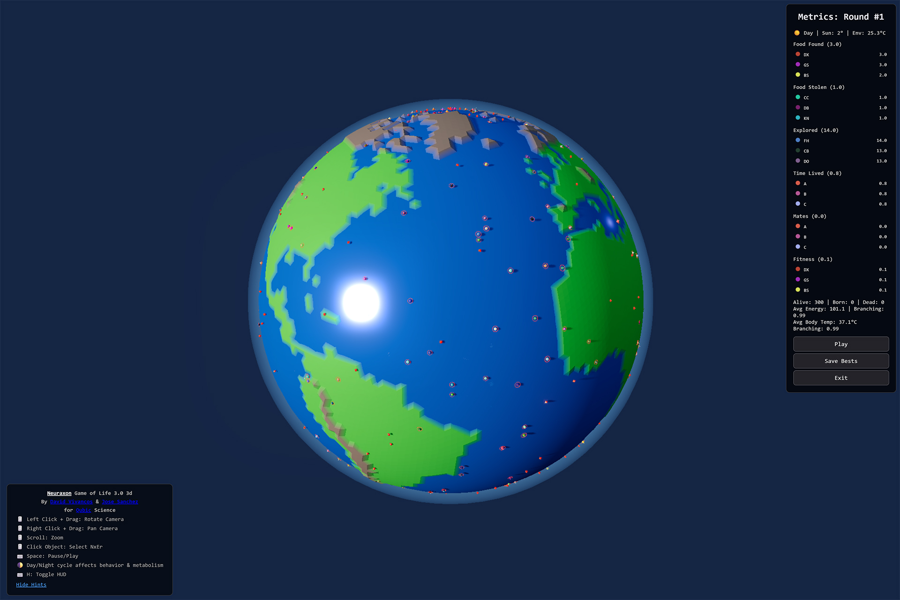

### 📅 Change Log (Game of Life Research Version)

**Previous January / February 2026 Updates ( Game Of Life Resarch v2.x & 3.x)**
- Find them here: https://github.com/DavidVivancos/Neuraxon/blob/main/GameOfLife/changelog.md

Experience the new **3D WebGL Lite Version** at [HuggingFace](https://huggingface.co/spaces/DavidVivancos/NeuraxonLife).

## 🎮 Game of Life Research Lite Version 3.0 (3D WebGL)

The Lite version has been completely overhauled with a 3D engine while maintaining the core Neuraxon logic.

### New Features:
- **3D Spherical World**: Agents roam a planet-like grid, in full 3D via Three.js.
- **Dynamic Lighting**: Real-time Day/Night cycles with orbiting sun and atmosphere scattering.
- **Visual Feedback**:
  - 🌡️ Temperature indicators (Freeze/Overheat icons).
  - 💤 Resting/Sleeping animations (dimming/slower pulse).
  - ❤️ Particle effects for mating and birth.
  - 🌍 **Real Earth Map**: New simulation mode using real-world topographical data.

## 📸 Game of Life Lite Version Screenshot

    

## 🧠 v3 Key Innovations

### 1. Circadian Entrainment (The SCN Model)
Just as the Suprachiasmatic Nucleus (SCN) regulates biology based on light:
- **Phase 0.0 - 0.25 (Dawn/Day):** Dopamine & Norepinephrine rise (Activity).
- **Phase 0.50 - 0.75 (Dusk/Night):** Serotonin rises (Sleep/Maintenance).
- **Metabolic Impact:** Basal metabolic rate drops at night, conserving energy.

### 2. Thermodynamic Regulation
Agents now possess `body_temperature`.
- **Sources:** Metabolism (food), Activity (movement), Environment (sun), Social (huddling).
- **Q10 Effect:** Neural firing rates and spontaneous activity scale with temperature.
- **Homeostasis:** Agents must seek shade or warmth to maintain optimal ~37°C.

### 3. Proprioception
Input neurons now receive feedback from the agent's physical interactions:
- Detects repeated collisions (rocks/walls).
- Triggers **Force Turn** reflexes via Norepinephrine stress response to escape local minima (getting stuck).

---

## 📸 Demo Screenshots

  
  
  
<i>Interactive 3D visualization showing neural activity and neuromodulator flow</i>

