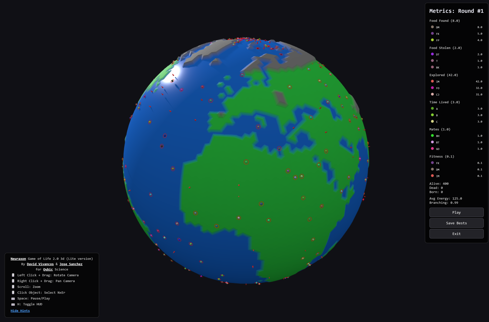

# Neuraxon

<div align="center">
<a href="https://www.python.org/"></a>
<a href="https://opensource.org/licenses/MIT"></a>
<a href="https://huggingface.co/spaces/DavidVivancos/Neuraxon">(Network Builder)</a>
<a href="https://huggingface.co/spaces/DavidVivancos/NeuraxonLife"> (Game Of Life Lite)</a>
<a href="https://www.researchgate.net/publication/397331336_Neuraxon"></a>
<a href="https://github.com/DavidVivancos/Neuraxon"></a>
<a href="https://huggingface.co/datasets/DavidVivancos/NeuraxonLife2-1M"></a>
  <a href="https://huggingface.co/datasets/DavidVivancos/NeuraxonLife2.1-TimeSeries"></a>
</div>

<br>
New Research  2.37 and Lite version 2.0<br>
Experience Neuraxon's  **Game of Life** Lite at [HuggingFace](https://huggingface.co/spaces/DavidVivancos/NeuraxonLife).<br>
CHANGE LOG:<br>
Jan 24th 2026:<br>
-> v2.37: E/I Balance Fix <br>
Jan 23rd 2026:<br>
-> v2.36: Bioinspired Trinary State Rebalancing<br>
-> v2.35: Properly caps intrinsic timescale<br>
Jan 22nd 2026:<br>
-> v2.34: Inherit Synaptic Weights update<br>
Jan 21st 2026:<br>
-> v2.33: code and performance optimizations<br>
-> v2.32: Autoreceptor Negative Feedback Fix<br>
Jan 20th 2026:<br>
-> v.2.31: Synaptic Weight Homeostasis<br>
-> v.2.30: Energy-Aware Firing Threshold<br>
Jan 17th 2026:<br>
-> v2.29: Global NeuroModulator updates<br>
-> v.2.30 Energy-Aware Firing Threshold <br>
Jan 16th 2026:<br>
-> v2.28: Dopamine Dynamics update <br>
-> v2.27: Serotonin update  <br>
Jan 15th 2026:<br>
-> v2.26: Neuromodulators update<br>
Jan 12th 2026:<br>
-> v2.25: Log Mode 3 enabled for deep detailed timeseries at non agragated Nxer level<br>
Jan 10th 2026:<br>
-> v2.24: Sparse comrpesing some Timeseries data to reduce memory usage and improve performance<br>
Jan 9th 2026:<br>
-> v2.23: God mode disabled and improved biological parameters  <br>
Jan 8th 2026:<br>
-> v2.21: New Nxrs Naming convention for Long Game Tracking Through sesions no more duplicate names in next rounds<br>
-> v2.22: Extra Logging enabled up to 1000s timesteps configurable<br>
Jan 7th 2026 v 2.2 Research update. Enhanced Full Fledged Inheritance <br>
Jan 4th 2026 v 2.1 Research update. and new HF Dataset https://huggingface.co/datasets/DavidVivancos/NeuraxonLife2.1-TimeSeries<br>


### Lite Version Features, (Research edition bellow):
- 🌍 **Procedurally Generated Worlds**: Island-like terrains with land, sea, and obstacles and new Earth mode in V 2.0
- 🧬 **Evolutionary Dynamics**: Agents reproduce, passing neural parameters to offspring
- 🍖 **Resource Competition**: Food sources respawn dynamically; agents must forage to survive
- 🤝 **Social Behaviors**: Mating, cooperation, and competition emerge from neural dynamics
- 🧠 **Neural Diversity**: Each agent has unique network parameters (learning rates, timescales, connectivity)
- 📊 **Real-time Analytics**: Track food consumption, exploration, mating success, and fitness scores

No installation required—just open your browser and explore!

## 📸 Game Screenshot
<div align="center">
    
</div>

<hr />

## 📊 NeuraxonLife2-1M Dataset ( Regular + Full Version)

**NEW**: We've released a comprehensive dataset of 1M+ evolved neural networks from our artificial life simulations!
Update 12/10/25: Added A Full version to include also each full game info captured check NeuraxonLife2-1MFull_manifest.json at HuggingFace data repor for details

<a href="https://huggingface.co/datasets/DavidVivancos/NeuraxonLife2-1M"></a>

The **NeuraxonLife2-1M Dataset** contains detailed simulation data capturing:
- 🧠 Complete neural architectures and synaptic connectivity
- ⚡ Multi-timescale synaptic weights (fast, slow, meta)
- 🧬 Neuromodulation states (dopamine, serotonin, acetylcholine, norepinephrine)
- 📈 Behavioral performance and fitness metrics
- 🌳 Dendritic branch computation data

### Dataset Structure

| Table | Description | Key Data |
|-------|-------------|----------|
| `nxers.parquet` | Agent-level data | Neural parameters, fitness scores, lineage |
| `neurons.parquet` | Neuron-level data | Membrane potentials, phases, health |
| `synapses.parquet` | Synapse-level data | Multi-timescale weights, delays, plasticity |
| `branches.parquet` | Dendritic branches | Branch potentials, plateau dynamics |

### Quick Start
```python
from datasets import load_dataset

# Load from Hugging Face Hub
dataset = load_dataset("DavidVivancos/NeuraxonLife2-1M")

# Or with pandas
import pandas as pd
nxers = pd.read_parquet('neuraxonLife2-1M_nxers.parquet')
```

### Research Applications

- **Fitness Prediction**: Predict agent fitness from neural parameters
- **Evolutionary Dynamics**: Track neural evolution across generations
- **Network Topology Analysis**: Study evolved architectures
- **Neuromodulation Research**: Investigate modulator dynamics
- **Synaptic Weight Distribution**: Analyze learned connection patterns

👉 [**Explore the full dataset on Hugging Face**](https://huggingface.co/datasets/DavidVivancos/NeuraxonLife2-1M)


Also Experience Neuraxon's trinary neural dynamics with our **interactive 3D visualization** at [HuggingFace](https://huggingface.co/spaces/DavidVivancos/Neuraxon).

### Interactive Network Builder Demo Features:
- 🧠 **Build Custom Networks**: Configure neurons, synapses, and plasticity parameters
- 🎯 **Interactive Controls**: Manually set input neuron states (excitatory/neutral/inhibitory)
- 🔬 **Live Neuromodulation**: Adjust dopamine 🎯, serotonin 😊, acetylcholine 💡, and norepinephrine ⚡ in real-time
- 📊 **3D Visualization**: Watch neural activity flow through the network with curved synaptic connections
- ⚙️ **Preset Configurations**: Try small networks, large networks, high plasticity modes, and more
- ▶️ **Real-time Simulation**: Run continuous processing and observe emergent dynamics

No installation required—just open your browser and explore!

## 📸 Demo Screenshots

<div align="center">
  
  
  <p><i>Interactive 3D visualization showing neural activity and neuromodulator flow</i></p>
</div>

<hr />

## Star History

[](https://www.star-history.com/#DavidVivancos/Neuraxon&type=date&legend=top-left)

## 👋 Overview

**Neuraxon** is a bio-inspired neural network framework that extends beyond traditional perceptrons through **trinary logic** (-1, 0, 1), capturing excitatory, neutral, and inhibitory dynamics found in biological neurons.

Unlike conventional neural networks that use discrete time steps and binary activation, Neuraxon features:
- **Continuous processing** where inputs flow as constant streams
- **Multi-timescale computation** at both neuron and synapse levels
- **Dynamic plasticity** with synaptic formation, collapse, and rare neuron death
- **Neuromodulation** inspired by dopamine, serotonin, acetylcholine, and norepinephrine
- **Spontaneous activity** mirroring task-irrelevant yet persistent brain processes

This implementation includes a hybridization with Qubic's **Aigarth Intelligent Tissue**, demonstrating evolutionary approaches to neural computation.

Check out our [paper](https://www.researchgate.net/publication/397331336_Neuraxon) for complete theoretical foundations and biological inspirations!

## 🧠 Key Innovations

### Trinary State Logic
Neuraxons operate in three states:
- **+1 (Excitatory)**: Active firing, promoting downstream activity
- **0 (Neutral)**: Subthreshold processing, enabling subtle modulation
- **-1 (Inhibitory)**: Active suppression of downstream activity

This third "neutral" state models:
- Metabotropic receptor activation
- Silent synapses that can be "unsilenced"
- Subthreshold dendritic integration
- Neuromodulatory influences

### Multi-Component Synapses
Each synapse maintains three dynamic weights:

```python
w_fast   # Ionotropic (AMPA-like), τ ~5ms - rapid signaling
w_slow   # NMDA-like, τ ~50ms - sustained integration  
w_meta   # Metabotropic, τ ~1000ms - long-term modulation
```

### Continuous Time Processing
Unlike discrete time-step models, Neuraxon processes information continuously:

```
τ (ds/dt) = -s + Σ w_i·f(s_i) + I_ext(t)
```

This enables:
- Real-time adaptation to streaming inputs
- Natural temporal pattern recognition
- Biologically plausible dynamics

## 🚀 Quick Start

### Installation

```bash
git clone https://github.com/DavidVivancos/Neuraxon.git
cd Neuraxon
pip install -r requirements.txt
```

### Basic Usage

```python
from neuraxon import NeuraxonNetwork, NetworkParameters

# Create network with default biologically-plausible parameters
params = NetworkParameters(
    num_input_neurons=5,
    num_hidden_neurons=20,
    num_output_neurons=5
)
network = NeuraxonNetwork(params)

# Set input pattern (trinary states: -1, 0, 1)
network.set_input_states([1, -1, 0, 1, -1])

# Run continuous simulation
for step in range(100):
    network.simulate_step()
    
    if step % 20 == 0:
        outputs = network.get_output_states()
        print(f"Step {step}: Outputs = {outputs}")

# Modulate network behavior via neuromodulators
network.modulate('dopamine', 0.8)  # Enhance learning
network.modulate('serotonin', 0.6)  # Adjust plasticity

# Save network state
from neuraxon import save_network
save_network(network, "my_network.json")
```
## 📊 Network Architecture

```
Input Layer (5 neurons)
    ↓ ↑ (bidirectional ring connectivity)
Hidden Layer (20 neurons)  
    ↓ ↑ (with spontaneous activity)
Output Layer (5 neurons)

Constraints:
- Small-world connectivity (~5% connection probability)
- No output → input connections
- Dynamic topology via structural plasticity
```

## 🔬 Advanced Features

### Synaptic Plasticity

Neuraxon implements continuous weight evolution inspired by STDP:

```python
# Weights evolve based on pre/post activity and neuromodulators
# LTP: pre=1, post=1 → strengthen synapse
# LTD: pre=1, post=-1 → weaken synapse
# Neutral state provides nuanced control
```

### Structural Plasticity

```python
# Synapses can form, strengthen, weaken, or die
# Neurons can die if health drops below threshold (hidden layer only)
# Silent synapses can be "unsilenced" through correlated activity
```

### Neuromodulation

```python
# Four neuromodulators with distinct roles:
neuromodulators = {
    'dopamine': 0.1,      # Learning & reward
    'serotonin': 0.1,     # Mood & plasticity
    'acetylcholine': 0.1, # Attention & arousal
    'norepinephrine': 0.1 # Alertness & stress response
}
```

## 🎯 Use Cases

Neuraxon is particularly suited for:

- **Continuous learning systems** that adapt in real-time
- **Temporal pattern recognition** in streaming data
- **Embodied AI and robotics** requiring bio-realistic control
- **Adaptive signal processing** with non-stationary inputs
- **Cognitive modeling** of brain-like computation
- **Energy-efficient AI** leveraging sparse, event-driven processing
- **Artificial life simulations** with evolutionary dynamics
- **Multi-agent systems** with emergent social behaviors
- **Neural architecture research** using our 1M+ evolved network dataset
- **Benchmarking** plasticity and neuromodulation algorithms
  
## 🖥️ Visualization & Tools

### Interactive Web Demo
Visit our [HuggingFace Space](https://huggingface.co/spaces/DavidVivancos/Neuraxon) for a fully interactive 3D visualization where you can:

- **Configure** all network parameters through an intuitive GUI
- **Visualize** neurons color-coded by state:
  - 🔴 Red = Excitatory (+1)
  - 🔵 Blue = Inhibitory (-1)
  - ⚪ Gray = Neutral (0)
- **Watch** neuromodulator particles (emoji sprites) flow along synaptic pathways
- **Control** input patterns and observe how they propagate through the network
- **Experiment** with different neuromodulator levels and see their effects
- **Compare** preset configurations (minimal, balanced, highly plastic, etc.)

The demo features a 3D sphere layout with curved synaptic connections and real-time particle effects representing neuromodulator dynamics.

## 📖 Configuration Parameters

All parameters have biologically plausible default ranges:

```python
@dataclass
class NetworkParameters:
    # Architecture
    num_input_neurons: int = 5         # [1, 100]
    num_hidden_neurons: int = 20       # [1, 1000]
    num_output_neurons: int = 5        # [1, 100]
    connection_probability: float = 0.05  # [0.0, 1.0]
    
    # Neuron dynamics
    membrane_time_constant: float = 20.0  # ms [5.0, 50.0]
    firing_threshold_excitatory: float = 1.0  # [0.5, 2.0]
    firing_threshold_inhibitory: float = -1.0 # [-2.0, -0.5]
    
    # Synaptic timescales
    tau_fast: float = 5.0    # ms [1.0, 10.0]
    tau_slow: float = 50.0   # ms [20.0, 100.0]
    tau_meta: float = 1000.0 # ms [500.0, 5000.0]
    
    # Plasticity
    learning_rate: float = 0.01  # [0.0, 0.1]
    stdp_window: float = 20.0    # ms [10.0, 50.0]
    
    # ... see code for complete parameter set
```
## 🧬 Aigarth Integration

This implementation hybridizes Neuraxon with [Aigarth Intelligent Tissue](https://github.com/Aigarth/aigarth-it), combining:

- **Neuraxon**: Sophisticated synaptic dynamics and continuous processing
- **Aigarth**: Evolutionary framework with mutation and natural selection

The hybrid creates "living neural tissue" that:
- Evolves structure through genetic-like mutations
- Adapts weights through synaptic plasticity
- Undergoes selection based on task performance
- Exhibits emergent complexity and self-organization


## 🎮 Neuraxon Game of Life 2.37

**A complete artificial life simulation powered by Neuraxon networks!**

* 2.01 version update: Added Metabolic Rate to the network parameters and calculations replacing  death by inactivity
* 2.02 version update: Fixed the Dopamine LTD and LTP thresholds to prevent always-on depression and always-on potentiation
* 2.03 version update: Improved save/load functionality including spike history, pre/post traces, state history and activation_history
* 2.1 version update:  Increased metabolic ramp to avoid dead agents,  Added autoSave and Level 2 logging default with in depth dynamics Increases Log size by 10x aprox
* 2.2 version update: Enhanced Full Fledged Inheritance
* 2.21 version update: New Nxrs Naming convention for Long Game Tracking Through sesions no more duplicate names in next rounds
* 2.22: Extra Logging enabled up to 1000s of timesteps configurable
* 2.23: God mode disabled and improved biological parameters
* 2.24: Sparse comrpesing some Timeseries data to reduce memory usage and improve performance
* 2.25: Log Mode 3 enabled for deep detailed timeseries at non agragated Nxer level
* 2.26: Neuromodulators update
* 2.27: Serotonin update
* 2.28: Dopamine Dynamics update
* 2.29: Global NeuroModulator updates
* 2.30: Energy-Aware Firing Threshold
* 2.31: Synaptic Weight Homeostasis
* 2.32: Autoreceptor Negative Feedback Fix
* 2.33: code and performance optimizations
* 2.34: Inherit Synaptic Weights update
* 2.35: Properly caps intrinsic timescale
* 2.36: Bioinspired Trinary State Rebalancing
* 2.37: E/I Balance Fix

The **Neuraxon Game of Life ** is a sophisticated demonstration of the framework's capabilities in an evolutionary, multi-agent environment. Each agent (called an "NxEr") is controlled by its own Neuraxon network, allowing emergent behaviors and evolutionary dynamics.

### Features

- 🌍 **Procedurally Generated Worlds**: Island-like terrains with land, sea, and obstacles
- 🧬 **Evolutionary Dynamics**: Agents reproduce, passing neural parameters to offspring
- 🍖 **Resource Competition**: Food sources respawn dynamically; agents must forage to survive
- 🤝 **Social Behaviors**: Mating, cooperation, and competition emerge from neural dynamics
- 🧠 **Neural Diversity**: Each agent has unique network parameters (learning rates, timescales, connectivity)
- 📊 **Real-time Analytics**: Track food consumption, exploration, mating success, and fitness scores
- ⚡ **Parallel Processing**: Multi-core neural network updates for scalable simulations
- 💾 **Save/Load System**: Preserve entire worlds or extract champion agents - Test Mode for Automated World creation

### Running the Simulation

```bash
# Launch with default settings
python NeuraxonGameOfLife2.py

# The configuration screen allows you to customize:
# - World size and terrain composition
# - Starting population and maximum agents
# - Food availability and respawn rates
# - Neural network complexity
# - Simulation speed and physics
```

### Gameplay Controls

**Camera:**
- `WASD` or `Arrow Keys`: Pan camera
- `Mouse Wheel`: Zoom in/out
- `Q/E`: Rotate view
- `Right Mouse Drag`: Pan camera

**Simulation:**
- `Space`: Pause/Resume
- `S`: Quick save
- `L`: Quick load
- `Click Agent`: View detailed stats (when paused)
- `Click Name in Rankings`: Select agent for inspection

**UI Buttons:**
- **Save Game**: Export complete world state
- **Load Game**: Import saved simulation
- **Save Best**: Export top-performing agents
- **Save NxEr/NxVizer**: Export individual agent brains

### Agent Behavior

Each NxEr has a **5-output Neuraxon network**:
- **Outputs 1-2**: Movement direction (X, Y)
- **Output 3**: Cooperation/sharing signal
- **Output 4**: Mating/attack intention
- **Output 5**: Clan Food sharing/help

**Input sensors** (6 neurons):
- Food detection
- Agent proximity
- Terrain type
- Vison range
- smeel radius
- Hunger

Agents exhibit:
- **Foraging**: Seeking and harvesting food sources
- **Exploration**: Discovering new territories
- **Mating**: Reproducing when conditions are favorable
- **Resource Management**: Balancing energy consumption
- **Adaptation**: Networks evolve through STDP and neuromodulation

### Evolutionary Mechanics

- **Reproduction**: Two agents can mate to produce offspring
- **Inheritance**: Child inherits neural parameters from both parents with variation
- **Selection**: Agents with low fitness die off; successful agents propagate
- **Amphibious Evolution**: Shore-based mating can produce amphibious offspring
- **Champion System**: Top performers survive across game rounds

### Performance Metrics

The simulation tracks multiple fitness dimensions:
- **Food Found**: Total food discovered
- **Food Taken**: Resources acquired from others
- **World Explored**: Unique tiles visited
- **Time Lived**: Survival duration
- **Mates Performed**: Reproductive success
- **Fitness Score**: Composite metric combining all factors

### Technical Highlights

- **Multiprocessing**: Worker pool distributes neural network updates across CPU cores
- **Adaptive Time-Stepping**: Simulation speed adjusts based on network activity
- **Toroidal World**: Wrapping boundaries create an infinite-feeling space
- **Collision Resolution**: Sophisticated interaction system for multi-agent conflicts
- **Energy Metabolism**: Biologically-inspired resource constraints
- **Neuromodulator Diffusion**: Spatial propagation of dopamine, serotonin, etc.

This simulation demonstrates Neuraxon's suitability for:
- Multi-agent reinforcement learning
- Evolutionary computation
- Artificial life research
- Emergent behavior studies
- Cognitive robotics


## 📚 Citation

If you use Neuraxon in your research, please cite:
```bibtex
@article{Vivancos-Sanchez-2025neuraxon,
    title={Neuraxon: A New Neural Growth \& Computation Blueprint},
    author={David Vivancos and Jose Sanchez},
    year={2025},
    journal={ResearchGate Preprint},
    institution={Artificiology Research, UNIR University, Qubic Science},
    url={https://www.researchgate.net/publication/397331336_Neuraxon}
}
```

If you use the NeuraxonLife2-1M dataset, please also cite:
```bibtex
@dataset{NeuraxonLife2-1M,
  title={Neuraxon: Artificial Life 2.0 BioInspired Neural Network Simulation 1M Dataset},
  author={Vivancos, David and Sanchez, Jose},
  year={2025},
  publisher={Hugging Face},
  url={https://huggingface.co/datasets/DavidVivancos/NeuraxonLife2-1M}
}
```

## 🤝 Contributing

We welcome contributions! Areas of interest include:

- Novel plasticity mechanisms
- Additional neuromodulator systems
- Energy efficiency optimizations
- New application domains
- Visualization tools
- Performance benchmarks
- Game of Life extensions and scenarios

Please open an issue to discuss major changes before submitting PRs.

## 📧 Contact

**David Vivancos**  
Artificiology Research https://artificiology.com/ , Qubic https://qubic.org/ Science Advisor
Email: vivancos@vivancos.com

**Jose Sanchez**  
UNIR University, Qubic https://qubic.org/ Science Advisor  
Email: jose.sanchezgarcia@unir.net

## 📄 License

MIT License. See `LICENSE` file for details.

## ⚠️ Important License Notice

**Core Neuraxon**: Licensed under MIT License (permissive, no restrictions)

**Aigarth Hybrid Features**: If you implement the Aigarth hybrid features described in our paper, you **MUST** comply with the [Aigarth License](THIRD_PARTY_LICENSES.md), which includes:

- ❌ **NO military use** of any kind
- ❌ **NO use by military-affiliated entities**
- ❌ **NO dual-use applications** with military potential

**See [NOTICE](NOTICE) for full details.**

The standalone Neuraxon implementation (without Aigarth integration) has no such restrictions.

## 🙏 Acknowledgments

This work builds upon decades of neuroscience research on:
- Synaptic plasticity (Bi & Poo, 1998)
- Neuromodulation (Brzosko et al., 2019)
- Spontaneous neural activity (Northoff, 2018)
- Continuous-time neural computation (Gerstner et al., 2014)

Special thanks to the Qubic's Aigarth team for the evolutionary tissue framework integration.

---

<div align="center">
<i>Building brain-inspired AI, one Neuraxon at a time</i> 🧠✨
</div>


